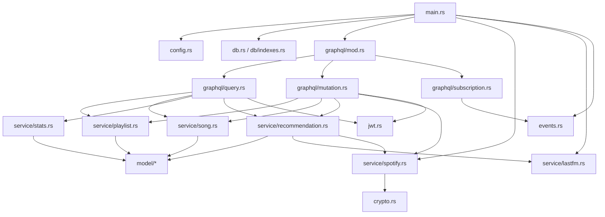

# Raport techniczny projektu Matchify

- Autorzy: Magdalena Śmietana, Dawid Komęza

---

## 1. Charakterystyka projektu

Matchify to aplikacja do wspólnego budowania playlist muzycznych. Użytkownicy logują się przez Spotify, tworzą playlisty, dołączają do nich kodem zaproszenia, proponują utwory i głosują na propozycje w mechanizmie przypominającym „swipe”. Po osiągnięciu progu głosów utwór zostaje zaakceptowany i może zostać zsynchronizowany z playlistą Spotify właściciela.

Repozytorium składa się z dwóch głównych części:

- `matchify-backend` - backend w Rust, API GraphQL oraz integracja z MongoDB, Spotify i Last.fm.
- `matchify-app` - aplikacja Expo React Native działająca mobilnie i webowo, komunikująca się z backendem przez GraphQL oraz GraphQL SSE.

Najważniejsza logika znajduje się w backendzie. Frontend jest klientem API, natomiast backend odpowiada za autoryzację, model domenowy, operacje bazodanowe, rekomendacje, statystyki i synchronizację ze Spotify.

## 2. Wykorzystane technologie

### Backend

- Rust 2024 - język implementacji backendu, z silnym typowaniem i asynchronicznym modelem wykonywania.
- Tokio - runtime asynchroniczny dla serwera HTTP, operacji bazodanowych i zapytań do API zewnętrznych.
- Axum - framework HTTP; w `src/main.rs` definiuje routing dla `/graphql` i `/graphql/ws`.
- async-graphql oraz async-graphql-axum - definicja schematu GraphQL, resolverów i integracja z Axum.
- MongoDB Rust Driver - komunikacja z MongoDB, typed collections, indeksy, operacje atomowe, agregacje i transakcje.
- Reqwest - klient HTTP do Spotify i Last.fm.
- Serde - serializacja i deserializacja struktur Rust do BSON/JSON.
- Chrono - obsługa dat i konwersja do typu daty BSON.
- jsonwebtoken - podpisywanie i weryfikacja tokenów JWT.
- AES-256-GCM przez `aes-gcm` - szyfrowanie tokenów Spotify przed zapisem w bazie.
- DashMap + Tokio broadcast - prosty broker zdarzeń w pamięci dla subskrypcji GraphQL.
- Tracing - logowanie zdarzeń backendu.

### Baza danych

Projekt używa MongoDB Cloud (MongoDB Atlas). Baza działa jako dokumentowy magazyn danych, a kolekcje odpowiadają głównym encjom domenowym: `users`, `playlists`, `songs`, `votes`, `recommendation_cache` i `recommendation_interactions`.

Backend nie wymaga lokalnego kontenera MongoDB. Połączenie jest konfigurowane przez zmienną `MONGO_URI`, zwykle w formacie `mongodb+srv://...` z panelu Atlas. Przy starcie aplikacja łączy się z klastrem, wykonuje `ping`, wybiera bazę `matchify` i tworzy wymagane indeksy.

### Frontend

Frontend jest aplikacją Expo/React Native i korzysta z:

- Expo SDK, React 19 i React Native,
- Expo Router do routingu,
- urql jako klienta GraphQL,
- graphql-sse dla subskrypcji,
- Zustand do stanu aplikacji,
- NativeWind/Tailwind do stylowania,
- GraphQL Code Generator do typów TypeScript generowanych ze schematu.

## 3. Architektura backendu

Backend jest podzielony na warstwy:

- `main.rs` - inicjalizacja konfiguracji, bazy, klientów Spotify/Last.fm, brokera zdarzeń, schematu GraphQL i routera Axum.
- `config.rs` - odczyt i walidacja zmiennych środowiskowych.
- `db.rs` oraz `db/indexes.rs` - połączenie z MongoDB, ping i tworzenie indeksów.
- `graphql/*` - publiczny kontrakt API: query, mutation i subscription.
- `model/*` - struktury dokumentów MongoDB oraz obiekty GraphQL.
- `service/*` - logika domenowa i operacje na bazie.
- `jwt.rs` - ekstrakcja użytkownika z nagłówka `Authorization` i obsługa JWT.
- `crypto.rs` - szyfrowanie i deszyfrowanie tokenów Spotify.
- `events.rs` - broker zdarzeń dla subskrypcji realtime.
- `error.rs` - wspólny typ błędów aplikacyjnych i mapowanie błędów na kody GraphQL.

Uproszczony graf zależności backendu:



Warstwa GraphQL nie przechowuje większości logiki biznesowej. Resolver sprawdza autoryzację, parsuje identyfikatory, pobiera zależności z kontekstu i wywołuje funkcje serwisowe. Dzięki temu logika domenowa jest skupiona w `service/*`, przede wszystkim w:

- `src/service/recommendation.rs` - rekomendacje, cache i scoring kandydatów,
- `src/service/spotify.rs` - OAuth, odświeżanie tokenów i operacje na Spotify API,
- `src/service/playlist.rs` - CRUD playlist oraz członkostwo,
- `src/service/song.rs` - propozycje, głosowanie, transakcje i synchronizacja zatwierdzonych utworów,
- `src/service/stats.rs` - agregacje raportowe MongoDB.

## 4. Model danych i schemat bazy

MongoDB przechowuje dokumenty z natywnymi identyfikatorami `ObjectId`. W GraphQL identyfikatory są zwracane jako tekst (`to_hex()`), ponieważ klient mobilny pracuje z ID jako stringami.

### `users`

Model `src/model/user.rs` przechowuje identyfikator użytkownika, `spotify_id`, dane profilu (`display_name`, `email`, `profile_image_url`), zaszyfrowane tokeny Spotify, datę wygaśnięcia access tokena i datę utworzenia konta. Unikalny indeks po `spotify_id` zapobiega duplikatom kont.

Tokeny Spotify są oznaczone jako `#[graphql(skip)]`, więc nie są eksponowane w API GraphQL.

### `playlists`

Model `src/model/playlist.rs` zawiera m.in. nazwę, opis, `owner_id`, `member_ids`, `invite_code`, `vote_threshold`, opcjonalne `spotify_playlist_id` oraz daty utworzenia i aktualizacji. Unikalny indeks po `invite_code` gwarantuje niepowtarzalność kodów zaproszeń.

Relacje są przechowywane jawnie:

- `owner_id` wskazuje dokument z `users`,
- `member_ids` przechowuje listę członków playlisty,
- `songs.playlist_id` łączy utwory z playlistą,
- `votes.playlist_id` pozwala szybko kasować głosy przy usuwaniu playlisty.

Wrapper GraphQL `PlaylistGql` dodaje pola wyliczane i zagnieżdżone: `state`, `owner`, `members`, `tracks` i `proposals`. `state` przyjmuje wartość `Seeding` albo `Active`; playlista staje się aktywna od 5 utworów `Approved` lub `Pending`.

### `songs`

Model `src/model/song.rs` opisuje utwór w playliście: `playlist_id`, `spotify_track_id`, metadane utworu, `proposed_by`, `status` (`Pending`, `Approved`, `Skipped`), `like_count` i `created_at`.

Najważniejsze indeksy:

- indeks po `(playlist_id, status)`,
- unikalny indeks po `(playlist_id, spotify_track_id)`.

Unikalny indeks blokuje wielokrotne dodanie tego samego utworu Spotify do tej samej playlisty.

### `votes`

Model `src/model/vote.rs` przechowuje `song_id`, `playlist_id`, `user_id`, typ głosu (`Like` albo `Skip`) i datę utworzenia. Unikalny indeks po `(song_id, user_id)` wymusza zasadę: jeden użytkownik może zagłosować na dany utwór tylko raz.

### `recommendation_cache`

Model `src/model/recommendation.rs` przechowuje znormalizowany `seed_key`, dane utworu źródłowego, listę kandydatów z Last.fm i `fetched_at`. Unikalny indeks po `seed_key` pozwala odświeżać wpis przez `update_one(...).upsert(true)`.

Cache jest świeży przez 7 dni. Po tym czasie backend ponownie pobiera podobne utwory z Last.fm i aktualizuje dokument.

### `recommendation_interactions`

Ta kolekcja zapisuje decyzje użytkownika wobec rekomendacji: `playlist_id`, `user_id`, `spotify_track_id`, `track_key`, akcję (`Accept` albo `Reject`) i `created_at`. Unikalny indeks po `(playlist_id, user_id, spotify_track_id)` pozwala nie proponować ponownie odrzuconych utworów.

## 5. Operacje bazodanowe

### Inicjalizacja bazy i indeksów

Backend łączy się z MongoDB w `db::connect`, parsując `MONGO_URI`, tworząc klienta i wykonując `ping`. Po połączeniu `db::indexes::create_indexes` tworzy indeksy wymuszające najważniejsze ograniczenia:

- unikalne Spotify ID użytkownika,
- unikalne kody zaproszeń,
- unikalny utwór Spotify w obrębie playlisty,
- unikalny głos użytkownika na utwór,
- unikalny klucz cache rekomendacji,
- unikalną interakcję użytkownika z rekomendacją.

Indeksy są tu częścią modelu domenowego, a nie tylko optymalizacją zapytań.

### Logowanie przez Spotify

Mutacja `login_with_spotify` wymienia kod OAuth na tokeny, pobiera profil użytkownika z `/v1/me`, szyfruje tokeny przez AES-256-GCM i wykonuje `find_one_and_update` po `spotify_id` z `upsert(true)`. Dzięki temu kolejne logowanie tego samego użytkownika aktualizuje tokeny i dane profilu bez tworzenia duplikatów kont. Odpowiedzią jest JWT podpisany sekretem aplikacji.

### Playlisty

Tworzenie playlisty (`service::playlist::create`) waliduje nazwę, generuje 8-znakowy alfanumeryczny `invite_code`, zapisuje dokument i przy kolizji unikalnego indeksu ponawia próbę maksymalnie 5 razy.

Dołączanie (`service::playlist::join`) wyszukuje playlistę po kodzie, sprawdza członkostwo i używa `$addToSet`, aby atomowo dodać użytkownika bez duplikatów. Jeżeli próg głosów był zarządzany automatycznie, backend aktualizuje też `vote_threshold`.

Aktualizacja playlisty jest dostępna tylko dla właściciela. Backend waliduje niepustą nazwę, maksymalną długość nazwy, `vote_threshold >= 1` oraz `vote_threshold <= liczba członków`. Zmiany są budowane jako dynamiczny dokument `$set`, więc aktualizowane są tylko pola podane przez klienta.

Opuszczanie playlisty blokuje wyjście właściciela, sprawdza członkostwo, usuwa użytkownika przez `$pull` i przelicza albo ogranicza `vote_threshold`.

### Usuwanie playlist i utworów

MongoDB nie wymusza relacji ani kaskadowego usuwania jak baza relacyjna, dlatego backend wykonuje je jawnie:

- przy usuwaniu playlisty kasuje najpierw głosy z `votes`, potem utwory z `songs`, a na końcu dokument z `playlists`,
- przy usuwaniu utworu kasuje powiązane głosy, a następnie sam utwór.

To świadomy koszt bazy dokumentowej: większa elastyczność schematu, ale odpowiedzialność za spójność relacji pozostaje po stronie aplikacji.

### Propozycje i głosowanie

`service::song::propose_track` sprawdza istnienie playlisty i członkostwo użytkownika, ogranicza liczbę oczekujących propozycji użytkownika do 10, pobiera metadane ze Spotify, zapisuje dokument w `songs` i publikuje zdarzenie `NewProposal`. Duplikaty blokuje unikalny indeks `(playlist_id, spotify_track_id)`.

`service::song::next_unvoted` używa pipeline agregacji:

- `$match` wybiera oczekujące utwory z playlisty,
- `$lookup` dołącza głosy danego użytkownika,
- kolejny `$match` zostawia tylko utwory bez głosu użytkownika,
- `$sort` wybiera najstarszą propozycję,
- `$limit: 1` zwraca jeden dokument.

Dzięki temu filtrowanie odbywa się w bazie, a nie po stronie aplikacji.

Najbardziej złożona operacja to `service::song::vote_on_track`. Backend pobiera utwór i playlistę, sprawdza członkostwo, otwiera sesję i transakcję MongoDB, wstawia dokument `Vote`, a dla głosu `Like` zwiększa `like_count` przez `$inc`. Jeżeli liczba polubień osiąga `vote_threshold`, status utworu zmienia się z `Pending` na `Approved`, a backend publikuje `TrackApproved`.

Transakcja chroni przed niespójnością: głos i licznik polubień powinny zmienić się razem. Kod obsługuje też transient transaction errors i ponawia transakcję do 3 razy. Wymaga to replica set albo klastra sharded; MongoDB Atlas spełnia ten warunek w typowej konfiguracji.

### Synchronizacja ze Spotify

Po zatwierdzeniu utworu backend uruchamia `tokio::spawn`, które pobiera właściciela playlisty, odświeża token Spotify, w razie potrzeby tworzy prywatną playlistę Spotify, zapisuje `spotify_playlist_id` i dodaje utwór do playlisty.

Błąd synchronizacji jest logowany, ale nie cofa głosu. To sensowny podział odpowiedzialności: głosowanie jest operacją domenową, a Spotify zewnętrzną integracją, która może chwilowo zawodzić.

### Rekomendacje

Rekomendacje łączą Last.fm, Spotify i MongoDB:

1. Backend wybiera do 10 najnowszych utworów `Approved` lub `Pending` jako seed.
2. Dla każdego seeda pobiera podobne utwory z cache albo Last.fm.
3. Normalizuje klucze `artist::title`.
4. Odrzuca utwory już istniejące w playliście oraz odrzucone przez użytkownika.
5. Agreguje kandydatów pojawiających się przy wielu seedach.
6. Dodaje bonus za wiele seedów i karę za nadmiar tego samego artysty.
7. Rozwiązuje kandydatów do realnych utworów Spotify przez wyszukiwanie.
8. Zwraca pierwszy pasujący wynik.

Akcja użytkownika na rekomendacji jest zapisywana w `recommendation_interactions` przez upsert. Przy `Reject` backend kończy operację, a przy `Accept` proponuje utwór i automatycznie oddaje głos `Like`.

### Statystyki i raporty

`service::stats` wykorzystuje aggregation pipeline:

- `get_home_report` liczy podsumowanie użytkownika, aktywność playlist, aktywnych członków, top artystów i oczekujące utwory.
- `get_playlist_stats` liczy statystyki jednej playlisty, udział członków i najpopularniejsze oczekujące propozycje.

Wykorzystywane są m.in. `$match`, `$lookup`, `$group`, `$sum`, `$cond`, `$avg`, `$project`, `$sort` i `$limit`. MongoDB służy więc nie tylko do prostego CRUD, ale też do agregacji analitycznych.

## 6. API GraphQL

Schemat GraphQL składa się z `Query`, `Mutation` i `MatchifySubscription`.

Najważniejsze query:

- `me` - aktualny użytkownik,
- `playlist(id)` - szczegóły playlisty,
- `myPlaylists` - playlisty użytkownika,
- `homeReport` - raport główny,
- `nextProposal(playlistId)` - następna propozycja do głosowania,
- `playlistStats(playlistId)` - statystyki playlisty,
- `searchTracks(query, limit)` - wyszukiwanie Spotify,
- `nextRecommendation(playlistId, excludedSpotifyTrackIds)` - kolejna rekomendacja.

Najważniejsze mutacje:

- `loginWithSpotify`,
- `createPlaylist`,
- `joinPlaylist`,
- `updatePlaylist`,
- `leavePlaylist`,
- `deletePlaylist`,
- `addInitialTracks`,
- `voteOnTrack`,
- `proposeTrack`,
- `deleteTrack`,
- `respondToRecommendation`.

Subskrypcje:

- `trackApproved(playlistId)`,
- `newProposal(playlistId)`.

Subskrypcje są zabezpieczone przez `guard_member`, który sprawdza JWT i członkostwo w playliście.

## 7. Bezpieczeństwo

### JWT

Po logowaniu backend podpisuje JWT z:

- `sub` - `ObjectId` użytkownika,
- `iat` - czas wystawienia,
- `exp` - czas wygaśnięcia.

Token jest wysyłany przez klienta w nagłówku:

```text
Authorization: Bearer <token>
```

Extractor `OptionalAuthUser` w `jwt.rs` odczytuje token i przekazuje użytkownika do kontekstu GraphQL.

### Szyfrowanie tokenów Spotify

Access token i refresh token Spotify są szyfrowane przed zapisem w MongoDB:

- algorytm: AES-256-GCM,
- klucz: `ENCRYPTION_KEY` o długości dokładnie 32 bajtów,
- nonce: losowe 12 bajtów,
- format zapisu: `nonce_base64:ciphertext_base64`.

To ogranicza skutki potencjalnego wycieku bazy, ponieważ tokeny nie są przechowywane jawnie.

### Walidacja i autoryzacja

Backend sprawdza format `ObjectId`, członkostwo w playliście, uprawnienia właściciela przy edycji i usuwaniu, limity propozycji, zakres `vote_threshold` oraz obecność sekretów i kluczy API przy starcie. Błędy domenowe są mapowane na kody GraphQL, np. `BAD_USER_INPUT`, `FORBIDDEN`, `NOT_FOUND` i `UNAUTHENTICATED`.

## 8. Dyskusja zastosowanych technik

### Zalety

- Rust i Tokio dobrze pasują do backendu I/O-bound, który często czeka na MongoDB, Spotify albo Last.fm.
- GraphQL ułatwia frontendowi pobieranie dokładnie tych pól, które są potrzebne na ekranie.
- Warstwa serwisów oddziela logikę domenową od resolverów GraphQL.
- MongoDB pasuje do modelu aplikacji, bo encje mają dokumentowy charakter, a część danych Spotify można zapisać bez projektowania wielu tabel słownikowych.
- Indeksy unikalne działają jako realne zabezpieczenia przed duplikatami.
- Event broker i subskrypcje GraphQL dają frontendowi informacje o nowych propozycjach i zatwierdzonych utworach w czasie rzeczywistym.

### Ograniczenia i ryzyka

- Brak relacji wymuszanych przez bazę oznacza, że operacje kaskadowe muszą być ręcznie utrzymywane w kodzie.
- Broker zdarzeń działa w pamięci procesu. Po restarcie backendu zdarzenia przepadają, a przy wielu instancjach każda miałaby własny broker. Produkcyjnie lepszy byłby Redis Pub/Sub, NATS albo Kafka.
- Synchronizacja ze Spotify jest asynchroniczna i nie ma kolejki retry. Przy awarii Spotify utwór zostaje zatwierdzony w Matchify, ale może nie zostać dodany do Spotify.

## 9. Instrukcja uruchomienia projektu

### Wymagania

- Rust z Cargo,
- Node.js albo Bun/npm dla frontendu,
- konto i klaster MongoDB Cloud/MongoDB Atlas,
- konto developerskie Spotify i aplikacja Spotify OAuth,
- klucz API Last.fm.

### 1. Konfiguracja MongoDB Cloud

W MongoDB Atlas należy przygotować klaster, użytkownika bazy z uprawnieniami odczytu i zapisu do bazy `matchify` oraz Network Access dopuszczający adres IP maszyny uruchamiającej backend.

Z panelu Atlas należy skopiować connection string w formacie SRV, np.:

```text
mongodb+srv://<user>:<password>@<cluster-url>/?retryWrites=true&w=majority
```

Backend w kodzie wybiera bazę `matchify`, dlatego connection string powinien wskazywać klaster, a nie lokalny port bazy.

### 2. Konfiguracja backendu

W katalogu `matchify-backend` należy przygotować plik `.env`:

```env
PORT=8082
MONGO_URI=mongodb+srv://<user>:<password>@<cluster-url>/?retryWrites=true&w=majority
ENCRYPTION_KEY=12345678901234567890123456789012
JWT_SECRET=change-me-to-at-least-32-characters
SPOTIFY_CLIENT_ID=your_spotify_client_id
SPOTIFY_CLIENT_SECRET=your_spotify_client_secret
LASTFM_API_KEY=your_lastfm_api_key
```

`ENCRYPTION_KEY` musi mieć dokładnie 32 bajty, a `JWT_SECRET` co najmniej 32 znaki.

Uruchomienie backendu:

```bash
cd matchify-backend
cargo run
```

Domyślnie API będzie dostępne pod:

```text
http://localhost:8082/graphql
```

Endpoint subskrypcji GraphQL SSE:

```text
http://localhost:8082/graphql/ws
```

Testy jednostkowe:

```bash
cd matchify-backend
cargo test
```

Część testów integracyjnych jest oznaczona jako `#[ignore]`, bo wymaga działającej MongoDB. Można je uruchomić poleceniem:

```bash
cd matchify-backend
cargo test -- --ignored
```

### 3. Konfiguracja frontendu

W katalogu `matchify-app` należy ustawić zmienne środowiskowe, np. w `.env.local`:

```env
EXPO_PUBLIC_API_URL=http://localhost:8082
EXPO_PUBLIC_SPOTIFY_CLIENT_ID=your_spotify_client_id
```

Instalacja zależności i start:

```bash
cd matchify-app
npm install
npm run start
```

Uruchomienie w przeglądarce:

```bash
cd matchify-app
npm run web
```

Generowanie typów GraphQL dla frontendu:

```bash
cd matchify-app
npm run codegen
```
