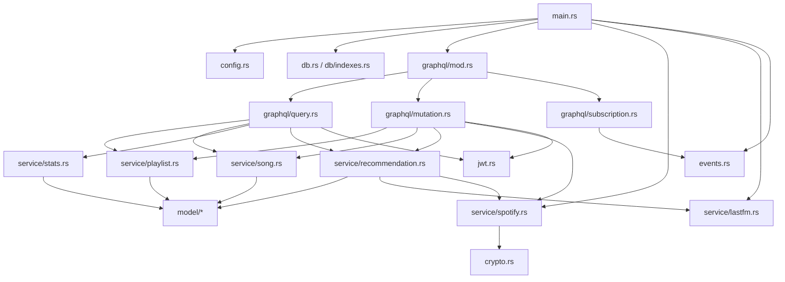

# Raport techniczny projektu Matchify

## 1. Charakterystyka projektu

Matchify jest aplikacja do wspolnego budowania playlist muzycznych. Uzytkownicy loguja sie przez Spotify, tworza playlisty, dolaczaja do nich kodem zaproszenia, proponuja utwory i glosuja na propozycje w mechanizmie przypominajacym "swipe". Po osiagnieciu progu glosow utwor zostaje zaakceptowany i moze zostac zsynchronizowany z playlista Spotify wlasciciela.

Repozytorium sklada sie z dwoch glownych czesci:

- `matchify-backend` - backend w Rust, API GraphQL, integracja z MongoDB, Spotify i Last.fm.
- `matchify-app` - aplikacja mobilna/webowa Expo React Native, komunikujaca sie z backendem przez GraphQL i GraphQL SSE.

Najistotniejsza logika projektu znajduje sie w backendzie. Frontend jest klientem API, natomiast backend odpowiada za autoryzacje, model domenowy, operacje bazodanowe, rekomendacje, statystyki i synchronizacje ze Spotify.

## 2. Wykorzystane technologie

### Backend

- Rust 2024 - jezyk implementacji backendu. Projekt korzysta z silnego typowania, struktur danych mapowanych na dokumenty MongoDB oraz asynchronicznego modelu wykonywania.
- Tokio - runtime asynchroniczny dla serwera HTTP, operacji bazodanowych i zapytan HTTP do API zewnetrznych.
- Axum - framework HTTP. W `src/main.rs` definiuje routing dla `/graphql` i `/graphql/ws`.
- async-graphql oraz async-graphql-axum - definicja schematu GraphQL, resolverow query, mutation i subscription oraz integracja z Axum.
- MongoDB Rust Driver - komunikacja z baza MongoDB, typed collections, indeksy, operacje atomowe, agregacje i transakcje.
- Reqwest - klient HTTP do API Spotify i Last.fm.
- Serde - serializacja i deserializacja struktur Rust do BSON/JSON.
- Chrono - obsluga dat, z konwersja do typu daty BSON przez helpery sterownika MongoDB.
- jsonwebtoken - podpisywanie i weryfikacja tokenow JWT.
- AES-256-GCM przez `aes-gcm` - szyfrowanie tokenow Spotify przed zapisem w bazie.
- DashMap + Tokio broadcast - prosty broker zdarzen w pamieci dla subskrypcji GraphQL.
- Tracing - logowanie zdarzen backendu.

### Baza danych

Projekt uzywa MongoDB Cloud (MongoDB Atlas). Baza dziala jako dokumentowy magazyn danych, a kolekcje odpowiadaja glownym encjom domenowym: `users`, `playlists`, `songs`, `votes`, `recommendation_cache` i `recommendation_interactions`.

Backend nie wymaga juz lokalnego kontenera MongoDB. Polaczenie jest konfigurowane przez zmienna `MONGO_URI`, najczesciej w formacie `mongodb+srv://...` wygenerowanym w panelu MongoDB Atlas. Przy starcie aplikacja laczy sie z klastrem, wykonuje `ping`, wybiera baze `matchify` i tworzy wymagane indeksy.

### Frontend

Frontend jest aplikacja Expo/React Native:

- Expo SDK, React 19, React Native,
- Expo Router dla routingu,
- urql jako klient GraphQL,
- graphql-sse dla subskrypcji,
- Zustand dla stanu aplikacji,
- NativeWind/Tailwind dla stylowania,
- GraphQL Code Generator dla typow TypeScript generowanych ze schematu.

## 3. Architektura backendu

Backend jest podzielony na warstwy:

- `main.rs` - inicjalizacja konfiguracji, bazy, klientow Spotify/Last.fm, brokera zdarzen, schematu GraphQL i routera Axum.
- `config.rs` - odczyt i walidacja zmiennych srodowiskowych.
- `db.rs` oraz `db/indexes.rs` - polaczenie z MongoDB, ping i tworzenie indeksow.
- `graphql/*` - publiczny kontrakt API: query, mutation, subscription.
- `model/*` - struktury dokumentow MongoDB oraz obiekty GraphQL.
- `service/*` - logika domenowa i operacje na bazie.
- `jwt.rs` - ekstrakcja uzytkownika z naglowka `Authorization` i obsluga JWT.
- `crypto.rs` - szyfrowanie i deszyfrowanie tokenow Spotify.
- `events.rs` - broker zdarzen dla subskrypcji realtime.
- `error.rs` - wspolny typ bledow aplikacyjnych oraz mapowanie bledow na kody GraphQL.

Uproszczony graf zaleznosci backendu:



Warstwa GraphQL nie zawiera wiekszosci logiki biznesowej. Resolver sprawdza autoryzacje, parsuje identyfikatory, pobiera zaleznosci z kontekstu i wywoluje funkcje serwisowe. Dzieki temu logika domenowa jest skupiona w `service/*`. Najwazniejsze serwisy:
- `src/service/recommendation.rs` - logika rekomendacji, cache i scoringu kandydatow,
- `src/service/spotify.rs` - integracja OAuth, odswiezanie tokenow i operacje na Spotify API,
- `src/service/playlist.rs` - operacje CRUD playlist oraz zarzadzanie czlonkostwem,
- `src/model/playlist.rs` - model playlisty i resolvery GraphQL,
- `src/service/song.rs` - propozycje, glosowanie, transakcje i synchronizacja zatwierdzonych utworow,
- `src/service/stats.rs` - agregacje raportowe MongoDB.

Z tego powodu dalszy opis skupia sie przede wszystkim na warstwie backendowej i operacjach bazodanowych.

## 4. Model danych i schemat bazy

MongoDB przechowuje dokumenty z natywnymi identyfikatorami `ObjectId`. W GraphQL identyfikatory sa zwracane jako tekst (`to_hex()`), poniewaz klient mobilny pracuje z ID jako stringami.

### `users`

Model: `src/model/user.rs`

Pola:

- `_id: ObjectId` - identyfikator uzytkownika.
- `spotify_id: String` - identyfikator konta Spotify.
- `display_name`, `email`, `profile_image_url` - dane profilu.
- `access_token`, `refresh_token` - tokeny Spotify zaszyfrowane w bazie.
- `token_expires_at` - data wygasniecia access tokena.
- `created_at` - data utworzenia konta w systemie.

Indeks:

- unikalny indeks po `spotify_id`.

Tokeny Spotify sa oznaczone jako `#[graphql(skip)]`, wiec nie sa eksponowane w API GraphQL.

### `playlists`

Model: `src/model/playlist.rs`

Pola:

- `_id: ObjectId`,
- `name`,
- `description`,
- `owner_id: ObjectId`,
- `member_ids: Vec<ObjectId>`,
- `invite_code: String`,
- `vote_threshold: i32`,
- `spotify_playlist_id: Option<String>`,
- `created_at`,
- `updated_at`.

Indeks:

- unikalny indeks po `invite_code`.

Relacje:

- `owner_id` wskazuje dokument z `users`,
- `member_ids` przechowuje liste uzytkownikow playlisty,
- `songs.playlist_id` laczy utwory z playlista,
- `votes.playlist_id` pozwala szybko kasowac glosy przy usuwaniu playlisty.

GraphQL wrapper `PlaylistGql` dodaje resolvery pol wyliczanych i zagniezdzonych:

- `state` - `Seeding` albo `Active`, wyliczane z liczby utworow `Approved` i `Pending`; playlista staje sie aktywna od 5 utworow.
- `owner`,
- `members`,
- `tracks` - zatwierdzone utwory,
- `proposals` - oczekujace propozycje.

### `songs`

Model: `src/model/song.rs`

Pola:

- `_id: ObjectId`,
- `playlist_id: ObjectId`,
- `spotify_track_id: String`,
- `title`, `artist`, `album`, `album_art_url`, `preview_url`, `duration_ms`,
- `proposed_by: ObjectId`,
- `status: TrackStatus` (`Pending`, `Approved`, `Skipped`),
- `like_count: i32`,
- `created_at`.

Indeksy:

- indeks po `(playlist_id, status)`,
- unikalny indeks po `(playlist_id, spotify_track_id)`.

Unikalny indeks blokuje wielokrotne dodanie tego samego utworu Spotify do tej samej playlisty.

### `votes`

Model: `src/model/vote.rs`

Pola:

- `_id: ObjectId`,
- `song_id: ObjectId`,
- `playlist_id: ObjectId`,
- `user_id: ObjectId`,
- `vote: VoteType` (`Like`, `Skip`),
- `created_at`.

Indeks:

- unikalny indeks po `(song_id, user_id)`.

Ten indeks wymusza zasade: jeden uzytkownik moze zaglosowac na dany utwor tylko raz.

### `recommendation_cache`

Model: `src/model/recommendation.rs`

Pola:

- `_id`,
- `seed_key` - znormalizowany klucz utworu zrodlowego,
- `seed_artist`,
- `seed_title`,
- `candidates` - lista kandydatow z Last.fm,
- `fetched_at`.

Indeks:

- unikalny indeks po `seed_key`.

Cache jest swiezy przez 7 dni. Po tym czasie backend ponownie pobiera podobne utwory z Last.fm i aktualizuje wpis przez `update_one(...).upsert(true)`.

### `recommendation_interactions`

Model: `src/model/recommendation.rs`

Pola:

- `_id`,
- `playlist_id`,
- `user_id`,
- `spotify_track_id`,
- `track_key`,
- `action: RecommendationAction` (`Accept`, `Reject`),
- `created_at`.

Indeks:

- unikalny indeks po `(playlist_id, user_id, spotify_track_id)`.

Kolekcja przechowuje decyzje uzytkownika wobec rekomendacji i pozwala nie proponowac ponownie odrzuconych utworow.

## 5. Operacje bazodanowe

### Inicjalizacja bazy i indeksow

Backend laczy sie z MongoDB w `db::connect`, parsujac `MONGO_URI`, tworzac klienta i wykonujac `ping`. Po polaczeniu `db::indexes::create_indexes` tworzy indeksy dla wszystkich najwazniejszych ograniczen:

- unikalne Spotify ID uzytkownika,
- unikalne kody zaproszen,
- unikalny utwor Spotify w obrebie playlisty,
- unikalny glos uzytkownika na utwor,
- unikalny klucz cache rekomendacji,
- unikalna interakcja uzytkownika z rekomendacja.

Zastosowanie indeksow jest istotne, bo czesc reguł domenowych jest wymuszana przez baze, a nie tylko przez kod aplikacji.

### Logowanie przez Spotify i zapis uzytkownika

Mutacja `login_with_spotify`:

1. Wymienia kod OAuth na tokeny Spotify.
2. Pobiera profil uzytkownika z `/v1/me`.
3. Szyfruje tokeny przez AES-256-GCM.
4. Wykonuje `find_one_and_update` po `spotify_id` z `upsert(true)`.
5. Zwraca JWT podpisany sekretem aplikacji.

Technicznie jest to operacja typu "utworz albo zaktualizuj". Dzieki temu wielokrotne logowanie tego samego uzytkownika aktualizuje tokeny i dane profilu, ale nie tworzy duplikatow kont.

### Tworzenie playlisty

Funkcja `service::playlist::create`:

- waliduje nazwe,
- generuje 8-znakowy alfanumeryczny `invite_code`,
- zapisuje dokument do `playlists`,
- przy kolizji unikalnego indeksu kodu zaproszenia ponawia probe maksymalnie 5 razy,
- po zapisie pobiera dokument z bazy.

Kod zaproszenia jest unikalny dzieki polaczeniu losowania i unikalnego indeksu. Sama aplikacja wykrywa blad duplicate key (`E11000`) i ponawia zapis.

### Dolaczanie do playlisty

Funkcja `service::playlist::join`:

- znajduje playliste po `invite_code`,
- jezeli uzytkownik juz jest czlonkiem, zwraca dokument bez kolejnego zapisu,
- uzywa `$addToSet`, aby atomowo dodac uzytkownika bez duplikatow,
- aktualizuje `vote_threshold`, jezeli prog byl zarzadzany automatycznie,
- zwraca dokument po aktualizacji (`ReturnDocument::After`).

Uzycie `$addToSet` jest dobrym przykladem wykorzystania dokumentowych operatorow MongoDB do zachowania idempotencji.

### Aktualizacja i opuszczanie playlisty

Aktualizacja playlisty jest dostepna tylko dla wlasciciela. Backend waliduje:

- niepusta nazwe,
- maksymalna dlugosc nazwy,
- `vote_threshold >= 1`,
- `vote_threshold <= liczba czlonkow`.

Zmiany sa budowane jako dynamiczny dokument `$set`, dzieki czemu aktualizowane sa tylko pola podane przez klienta.

Opuszczanie playlisty:

- blokuje opuszczenie przez wlasciciela,
- sprawdza czlonkostwo,
- usuwa uzytkownika przez `$pull`,
- przelicza albo ogranicza `vote_threshold`,
- aktualizuje `updated_at`.

### Usuwanie playlisty i utworu

MongoDB nie wymusza relacji ani kaskadowego usuwania jak relacyjna baza danych. Dlatego backend wykonuje to jawnie:

- przy usuwaniu playlisty kasuje najpierw glosy z `votes`, potem utwory z `songs`, a na koncu dokument z `playlists`,
- przy usuwaniu utworu kasuje powiazane glosy, a nastepnie sam utwor.

To jest swiadomy koszt uzycia bazy dokumentowej: wieksza elastycznosc schematu, ale odpowiedzialnosc za spojność relacji pozostaje po stronie aplikacji.

### Dodawanie propozycji utworu

Funkcja `service::song::propose_track`:

- sprawdza, czy playlista istnieje i czy uzytkownik jest jej czlonkiem,
- liczy oczekujace propozycje danego uzytkownika w danej playliscie,
- ogranicza liczbe pending proposals do 10,
- pobiera metadane utworu ze Spotify,
- zapisuje dokument w `songs`,
- publikuje zdarzenie `NewProposal` do brokera realtime.

Duplikaty sa blokowane przez unikalny indeks `(playlist_id, spotify_track_id)`.

### Pobieranie nastepnej propozycji do glosowania

Funkcja `service::song::next_unvoted` wykorzystuje pipeline agregacji:

- `$match` wybiera pending utwory z playlisty,
- `$lookup` dolacza glosy danego uzytkownika,
- kolejny `$match` zostawia tylko utwory bez glosu uzytkownika,
- `$sort` wybiera najstarsza propozycje,
- `$limit: 1` zwraca jeden dokument.

To pozwala przeniesc filtrowanie do bazy zamiast pobierac wszystkie propozycje i filtrowac je w aplikacji.

### Glosowanie i akceptacja utworu

Najbardziej zaawansowana operacja znajduje sie w `service::song::vote_on_track`.

Przebieg:

1. Backend pobiera utwor i playliste.
2. Sprawdza, czy uzytkownik jest czlonkiem playlisty.
3. Otwiera sesje i transakcje MongoDB.
4. Wstawia dokument `Vote`.
5. Dla glosu `Like` zwieksza `like_count` przez `$inc`.
6. Jezeli liczba polubien osiaga `vote_threshold`, zmienia status utworu z `Pending` na `Approved`.
7. Publikuje zdarzenie `TrackApproved`.
8. Po zatwierdzeniu transakcji zwraca zaktualizowany utwor.

Transakcja chroni operacje przed niespojnoscia: glos i licznik polubien powinny zmienic sie razem. Kod obsluguje rowniez transient transaction errors i ponawia transakcje do 3 razy.

Wazna uwaga wdrozeniowa: transakcje MongoDB wymagaja replica set albo klastra sharded. MongoDB Cloud/Atlas spelnia to wymaganie w typowej konfiguracji klastra, dlatego obecna wersja aplikacji jest dopasowana do transakcyjnej sciezki glosowania.

### Synchronizacja ze Spotify

Po zatwierdzeniu utworu backend uruchamia zadanie `tokio::spawn`, ktore:

- pobiera wlasciciela playlisty,
- odswieza token Spotify, jezeli trzeba,
- tworzy prywatna playliste Spotify, jezeli `spotify_playlist_id` nie istnieje,
- zapisuje `spotify_playlist_id` w `playlists`,
- dodaje utwor do playlisty Spotify.

Synchronizacja jest wykonywana asynchronicznie po stronie backendu. Blad synchronizacji jest logowany, ale nie cofa glosu. To dobra decyzja projektowa: glosowanie jest operacja domenowa, a Spotify jest integracja zewnetrzna, ktora moze chwilowo zawodzic.

### Rekomendacje

Rekomendacje lacza Last.fm, Spotify i MongoDB:

1. Backend wybiera do 10 najnowszych utworow `Approved` lub `Pending` jako seed.
2. Dla kazdego seeda pobiera podobne utwory z cache albo z Last.fm.
3. Normalizuje klucze `artist::title`.
4. Odrzuca utwory juz istniejace w playliscie oraz odrzucone przez uzytkownika.
5. Agreguje kandydatow pojawiajacych sie przy wielu seedach.
6. Dodaje bonus za wiele seedow i kare za nadmiar tego samego artysty.
7. Rozwiazuje kandydatow do realnych utworow Spotify przez wyszukiwanie.
8. Zwraca pierwszy pasujacy wynik.

Akcja uzytkownika na rekomendacji jest zapisywana w `recommendation_interactions` przez upsert. Przy `Reject` backend konczy operacje. Przy `Accept` backend proponuje utwor i automatycznie oddaje glos `Like`.

### Statystyki i raporty

Serwis `service::stats` pokazuje szerokie wykorzystanie aggregation pipeline:

- `get_home_report` liczy podsumowanie uzytkownika, aktywnosc playlist, aktywnych czlonkow, top artystow i oczekujace utwory.
- `get_playlist_stats` liczy statystyki jednej playlisty, udzial czlonkow i najpopularniejsze pending proposals.

Wykorzystywane mechanizmy MongoDB:

- `$match`,
- `$lookup` do laczenia `songs` z `votes` i `users`,
- `$group`,
- `$sum`,
- `$cond`,
- `$avg`,
- `$project`,
- `$sort`,
- `$limit`.

To jest najpelniejsza prezentacja mozliwosci bazy w projekcie: MongoDB nie sluzy tylko do prostego CRUD, ale rowniez do agregacji analitycznych.

## 6. API GraphQL

Schemat GraphQL sklada sie z:

- `Query`,
- `Mutation`,
- `MatchifySubscription`.

Najwazniejsze query:

- `me` - aktualny uzytkownik,
- `playlist(id)` - szczegoly playlisty,
- `myPlaylists` - playlisty uzytkownika,
- `homeReport` - raport glowny,
- `nextProposal(playlistId)` - nastepna propozycja do glosowania,
- `playlistStats(playlistId)` - statystyki playlisty,
- `searchTracks(query, limit)` - wyszukiwanie Spotify,
- `nextRecommendation(playlistId, excludedSpotifyTrackIds)` - kolejna rekomendacja.

Najwazniejsze mutacje:

- `loginWithSpotify`,
- `createPlaylist`,
- `joinPlaylist`,
- `updatePlaylist`,
- `leavePlaylist`,
- `deletePlaylist`,
- `addInitialTracks`,
- `voteOnTrack`,
- `proposeTrack`,
- `deleteTrack`,
- `respondToRecommendation`.

Subskrypcje:

- `trackApproved(playlistId)`,
- `newProposal(playlistId)`.

Subskrypcje sa zabezpieczone przez `guard_member`, ktory sprawdza JWT i czlonkostwo w playliscie.

## 7. Bezpieczenstwo

### JWT

Po logowaniu backend podpisuje JWT z:

- `sub` - `ObjectId` uzytkownika,
- `iat` - czas wystawienia,
- `exp` - czas wygasniecia.

Token jest wysylany przez klienta w naglowku:

```text
Authorization: Bearer <token>
```

Extractor `OptionalAuthUser` w `jwt.rs` odczytuje token i przekazuje uzytkownika do kontekstu GraphQL.

### Szyfrowanie tokenow Spotify

Access token i refresh token Spotify sa szyfrowane przed zapisem w MongoDB:

- algorytm: AES-256-GCM,
- klucz: `ENCRYPTION_KEY` o dlugosci dokladnie 32 bajtow,
- nonce: losowe 12 bajtow,
- format zapisu: `nonce_base64:ciphertext_base64`.

To ogranicza skutki potencjalnego wycieku bazy: tokeny nie sa przechowywane jawnie.

### Walidacja i autoryzacja

Backend sprawdza:

- format `ObjectId`,
- czlonkostwo w playliscie,
- uprawnienia wlasciciela przy edycji/usuwaniu playlist i utworow,
- limity liczby propozycji,
- poprawny zakres `vote_threshold`,
- wymagana obecnosc sekretow i kluczy API przy starcie.

Bledy domenowe sa mapowane na kody GraphQL, np. `BAD_USER_INPUT`, `FORBIDDEN`, `NOT_FOUND`, `UNAUTHENTICATED`.

## 8. Dyskusja zastosowanych technik

### Zalety przyjetej architektury

- Rust i Tokio dobrze pasuja do backendu I/O-bound: API wiekszosc czasu czeka na MongoDB, Spotify albo Last.fm.
- GraphQL ulatwia frontendowi pobieranie dokladnie tych pol, ktore sa potrzebne na ekranie.
- Warstwa serwisow oddziela logike domenowa od resolverow GraphQL.
- MongoDB pasuje do modelu aplikacji, bo encje maja naturalnie dokumentowy charakter, a czesc danych Spotify mozna zapisac bez projektowania wielu tabel slownikowych.
- Indeksy unikalne sa uzywane jako realne zabezpieczenia przed duplikatami, a nie tylko jako optymalizacja.
- Event broker i subskrypcje GraphQL daja frontendowi informacje o nowych propozycjach i zatwierdzonych utworach w czasie rzeczywistym.

### Ograniczenia i ryzyka

- Brak relacji wymuszanych przez baze oznacza, ze operacje kaskadowe musza byc recznie utrzymywane w kodzie.
- Broker zdarzen jest w pamieci procesu. Po restarcie backendu zdarzenia przepadaja, a przy wielu instancjach backendu kazda mialaby wlasny broker. Produkcyjnie lepszy bylby Redis Pub/Sub, NATS albo Kafka.
- Czesc resolverow zagniezdzonych moze generowac dodatkowe zapytania do bazy. Przy duzych listach mozna rozwazyc dataloadery albo agregacje.
- Synchronizacja ze Spotify jest asynchroniczna i nie ma kolejki retry. Przy awarii Spotify utwor zostaje zatwierdzony w Matchify, ale moze nie zostac dodany do Spotify.

## 9. Instrukcja uruchomienia projektu

### Wymagania

- Rust z Cargo,
- Node.js albo Bun/npm dla frontendu,
- konto i klaster MongoDB Cloud/MongoDB Atlas,
- konto developerskie Spotify i aplikacja Spotify OAuth,
- klucz API Last.fm.

### 1. Konfiguracja MongoDB Cloud

W MongoDB Atlas nalezy przygotowac klaster oraz uzytkownika bazy z uprawnieniami odczytu i zapisu do bazy `matchify`. Trzeba tez skonfigurowac Network Access, czyli dopuscic adres IP maszyny uruchamiajacej backend.

Z panelu MongoDB Atlas nalezy skopiowac connection string w formacie SRV. Przykladowy `MONGO_URI`:

```text
mongodb+srv://<user>:<password>@<cluster-url>/?retryWrites=true&w=majority
```

Backend w kodzie wybiera baze `matchify`, dlatego connection string powinien wskazywac klaster, a nie lokalny port bazy.

### 2. Konfiguracja backendu

W katalogu `matchify-backend` nalezy przygotowac plik `.env`:

```env
PORT=8082
MONGO_URI=mongodb+srv://<user>:<password>@<cluster-url>/?retryWrites=true&w=majority
ENCRYPTION_KEY=12345678901234567890123456789012
JWT_SECRET=change-me-to-at-least-32-characters
SPOTIFY_CLIENT_ID=your_spotify_client_id
SPOTIFY_CLIENT_SECRET=your_spotify_client_secret
LASTFM_API_KEY=your_lastfm_api_key
```

`ENCRYPTION_KEY` musi miec dokladnie 32 bajty, a `JWT_SECRET` co najmniej 32 znaki.

Uruchomienie backendu:

```bash
cd matchify-backend
cargo run
```

Domyslnie API bedzie dostepne pod:

```text
http://localhost:8082/graphql
```

Endpoint subskrypcji GraphQL SSE:

```text
http://localhost:8082/graphql/ws
```

Testy jednostkowe:

```bash
cd matchify-backend
cargo test
```

Czesc testow integracyjnych jest oznaczona jako `#[ignore]`, bo wymaga dzialajacej MongoDB. Mozna je uruchomic poleceniem:

```bash
cd matchify-backend
cargo test -- --ignored
```

### 3. Konfiguracja frontendu

W katalogu `matchify-app` nalezy ustawic zmienne srodowiskowe, np. w `.env.local`:

```env
EXPO_PUBLIC_API_URL=http://localhost:8082
EXPO_PUBLIC_SPOTIFY_CLIENT_ID=your_spotify_client_id
```

Instalacja zaleznosci i start:

```bash
cd matchify-app
npm install
npm run start
```

Uruchomienie w przegladarce:

```bash
cd matchify-app
npm run web
```

Generowanie typow GraphQL dla frontendu:

```bash
cd matchify-app
npm run codegen
```

## 10. Podsumowanie

Najwazniejsza technicznie czesc projektu to backend Rust + GraphQL + MongoDB. Projekt wykorzystuje MongoDB nie tylko jako prosty magazyn dokumentow, ale rowniez do wymuszania unikalnosci, operacji atomowych, transakcji i agregacji raportowych. Integracje Spotify i Last.fm sa oddzielone w serwisach, tokeny sa szyfrowane, a komunikacja realtime jest realizowana przez subskrypcje GraphQL oparte na brokerze zdarzen w pamieci.
